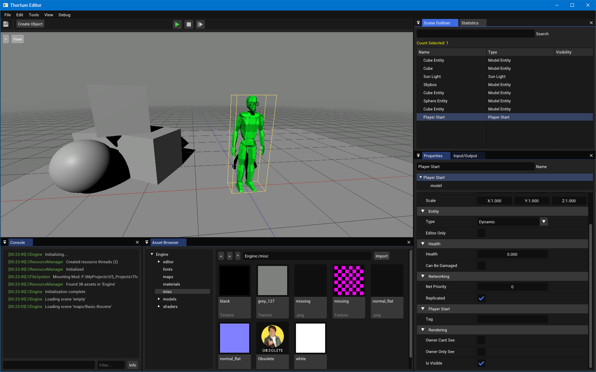

# Thorium Engine
3D game engine based on the Source engine and Unreal Engine

# Building
Requirements
- CMake 3.20.0 or greater
- MSVC 15 (Visual Studio 2017) or greater for windows
- GCC 11 or greater for linux

### Windows
- Run 'install.bat' as administrator
- Run 'src/build_buildtool.sh'
- Run 'src/generate.bat' this will generate a VS project in 'src/ThoriumEngine/Intermediate/build/'
- Open the generated project and compile the project.

### Linux
- Run 'install.sh'
- Run 'src/build.sh' to build the project
